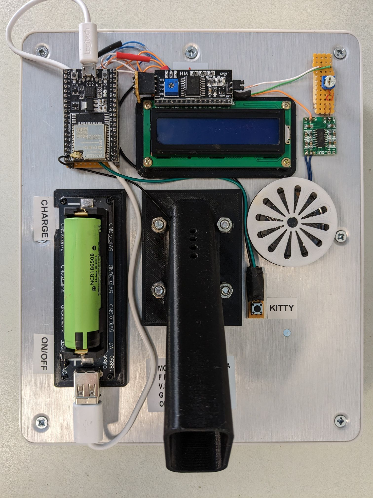
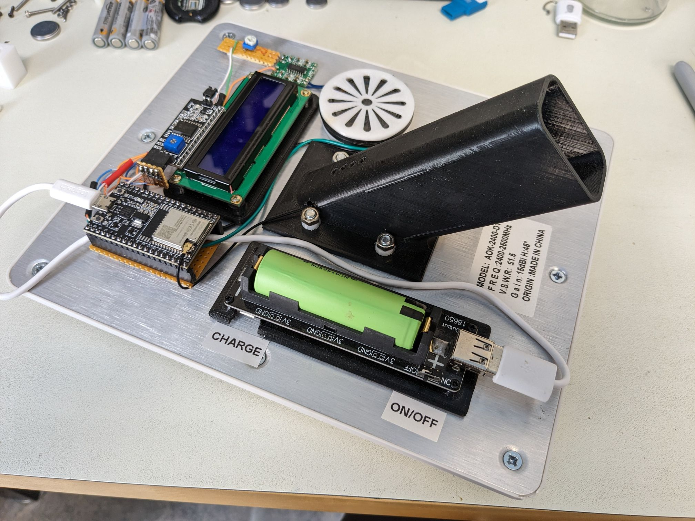
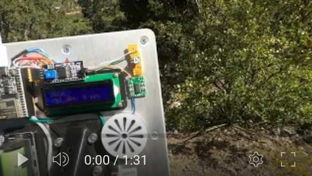
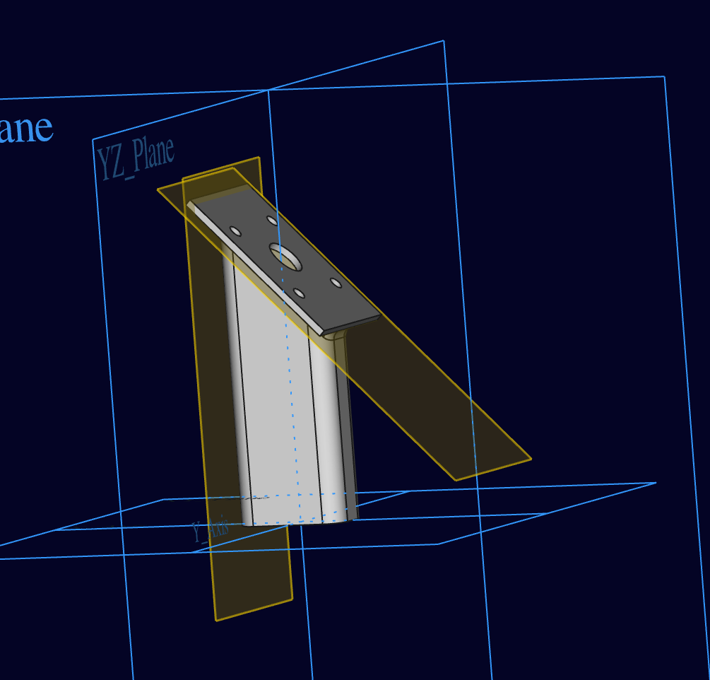

# BLE iBeacon locator

This is the firmware for a DIY gadget to locate nearby iBeacons.

## Usage

After turning the locator on, select the beacon to locate with the "kitty" button. When the locator picks up a ping from the selected beacon, a brief "beep" will sound. The pitch of the sound indicates signal strength, with higher pitch for stronger signal. Slowly point the device from side to side and walk in the direction indicated by generally higher pitched beeps in order to arrive at the location of the beacon.

The LCD shows the name of the selected beacon along with the signal strength and time since previous ping.

Adjust the speaker volume with the small pot.

The range appears to be a couple of hundred feet if there is line of sight to the beacon.

Finding my cat, Bela, who is sleeping outside with a BLE tag on his collar:

## Building

I'll flesh this section out if there's interest.

This can be built with inexpensive parts from AliExpress or similar. The handle, LCD and battery mounting plates and speaker cover are 3D printed.

The components and the handle are mounted on the back of a directional 2.4 GHz panel antenna. The LCD and battery are fasted to the mounting plates with screws, and the plates are fastened to the antenna with double-sided foam tape. The circuit board is fastened directly with double-sided foam tape. 

Use an app such as [BLE Scanner](https://play.google.com/store/apps/details?id=com.macdom.ble.blescanner&hl=en_US&gl=US&pli=1) to find the device addresses of iBeacons to be used with the locator. Add the device addresses and display names at the top of `main.c`. 

Connections:

| LCD   | ESP32     |
|-------|-----------|
| GND   | GND       |
| VCC   | VIN       |
| SDA   | GPIO 21   |
| SCL   | GPIO 22   |

| Speaker | ESP32  |
|---------|--------|
| GND     | GND    |
| VCC     | VIN    |
| Channel | GPIO 4 |

Search terms for parts:

| Part        | Search                                                                 |
|-------------|------------------------------------------------------------------------|
| ESP32       | ESP32-WROOM-32U development board with connection for external antenna |
| LCD         | LCD1602 16x2 PCF8574                                                   |
| Battery     | 18650 charging shield                                                  |
| Speaker amp | PAM8403 module                                                         |
| Speaker     | 0.5W small speaker                                                     |
| Antenna     | 2.4GHz WiFi directional panel antenna                                  |

### Troubleshooting

- If there's a build error, try `idf.py reconfigure`.

## 3D printed parts

`./print/handle.FCStd`

## Notes

- The detected signal strength has quite a bit of random variation, but is consistent enough to indicate the general direction to walk to get closer to the beacon.
- This device works with iBeacon tags that do not turn themselves off when not connected to a phone. It also works with any other BLE device that is broadcasting advertising packets.
- If the BLE device does not show up in apps such as BLE Scanner, it will probably not work with this device.

## Technologies

- [esp32](https://www.espressif.com/en/products/socs/esp32)
- [esp-idf](https://github.com/espressif/esp-idf)
- [esp-idf-lib](https://github.com/UncleRus/esp-idf-lib) (for driving the LCD)

